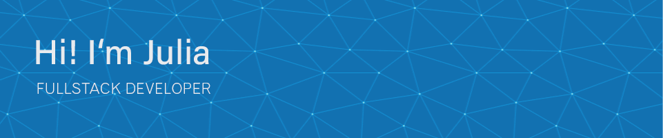

 

As a Full Stack Developer with a background in media design, I blend technical expertise with a deep understanding of complex user needs. In my most recent role, I designed web applications and managed CMS databases. 

I enjoy working with:

But I am also eager to explore and learn other technologies.&nbsp; 🚀
 

## Connect with me

 

## <b> Languages and Tools</b>

 

<table align="center">
 <tr>
   <td align="center" width="86">
   
     Python
   </td>
   <td align="center" width="86">
   
     Django
   </td>
   <td align="center" width="86">
   
     MySQL
   </td>
   <td align="center" width="86">
   
     Postman
   </td>
   <td align="center" width="86">
   
     Tailwind
   </td>
   <td align="center" width="86">
   
     Bootstrap
   </td>
 </tr>
 <tr>
   <td align="center" width="86">
   
     Astro
   </td>
   <td align="center" width="86">
   
     Vue.js
   </td>
   <td align="center" width="86">
   
     Pinia
   </td>
   <td align="center" width="86">
   
     HTML
   </td>
   <td align="center" width="86">
   
     CSS
   </td>
   <td align="center" width="86">
   
     JavaScript
   </td>
 </tr>
 <tr>
   <td align="center" width="86">
   
     GitHub
   </td>
   <td align="center" width="86">
   
     VS Code
   </td>
   <td align="center" width="86">
   
     npm
   </td>
   <td align="center" width="86">
   
     Figma
   </td>
   <td align="center" width="86">
   
     XD
   </td>
   <td align="center" width="86">
   
     Notion
   </td>
 </tr>
</table>

 

## Projects

| Projects              | Links                     | Tech Stack & Tools                                           |
|:----------------------|:--------------------------|:-------------------------------------------------------------|
| Job Scraper Package   | Repository                | `Python` `Notion`                                            |
| Job Data Hub          | Live ∙ Repository         | `Python` `Django` `SQLight 3` `Bootstrap` `Postman` `Notion` |
| Job Scraper Extension | Repository                | `JavaScript` `Chrome Webbrowser` `Notion`                    |
| Portfolio Lab         | Live ∙ Repository         | `JavaScript` `CSS` `Webcomponents` `Figma` `Notion`          |
| Time Snap             | Live ∙ Repository         | `Vue.js` `Pinia` `JavaScript` `Figma` `Miro`                 |

 

## Statistics

